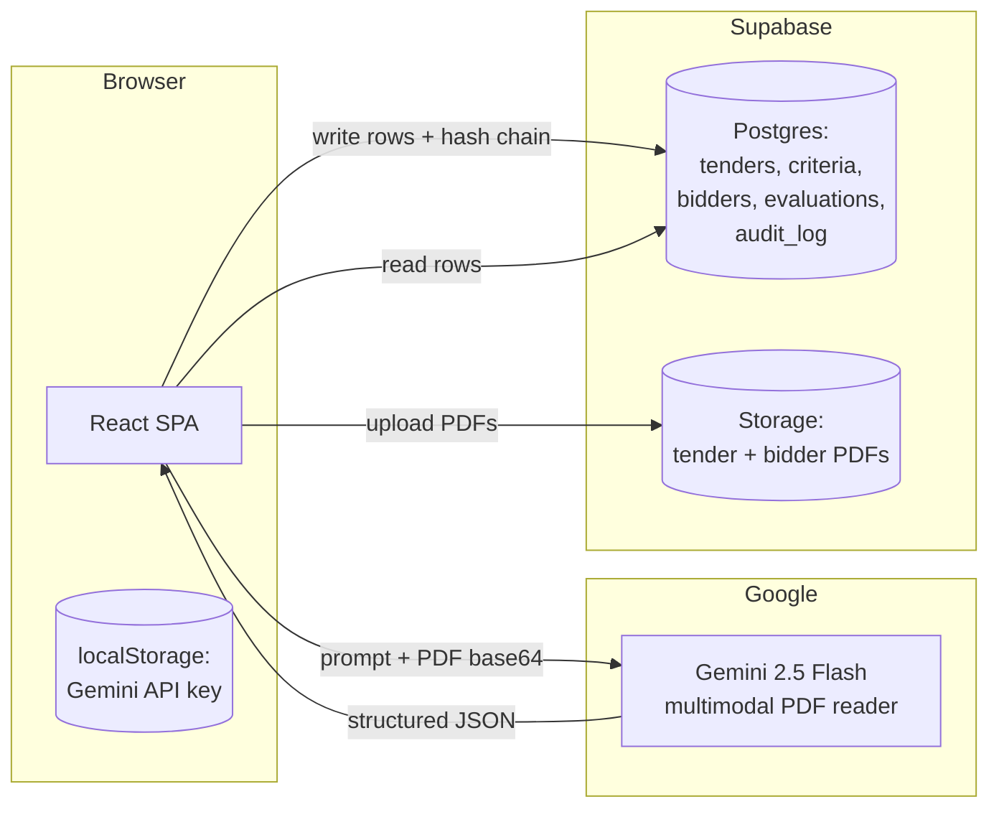

# Nirnay (निर्णय)

> **Every verdict, with evidence.**
> AI-powered government tender evaluation with citation-backed verdicts and a hash-chained audit trail.

Built for **PanIIT AI for Bharat Hackathon — Theme 3: CRPF Procurement.**

```
       ╔═══════════════════════════════════════╗
       ║  N I R N A Y   ·   निर्णय              ║
       ║  Citation-backed tender evaluation    ║
       ╚═══════════════════════════════════════╝
```

---

## The problem

Indian government procurement officers spend **weeks** manually checking each bidder's documents against eligibility criteria buried in 100-page tender PDFs. The work is tedious, error-prone, and impossible to audit after the fact — "why was this bidder rejected?" rarely has a clean answer.

Existing AI tools either (a) give black-box "yes / no" answers no officer can defend in court, or (b) require expensive on-prem OCR + LayoutLM pipelines that take months to deploy. Neither solves the real problem: **every verdict needs to point at the exact evidence in the bidder's documents.**

## What Nirnay does

1. **Reads the tender** — Gemini 2.5 Flash extracts every eligibility criterion as structured JSON. No OCR pipeline; Gemini is multimodal and reads PDFs natively.
2. **Reads each bidder's submission** — same pipeline, document-by-document.
3. **Evaluates** — for each `(bidder × criterion)` pair, returns: verdict, **exact quoted evidence**, source document name, page number, confidence score, and reasoning.
4. **Aggregates** with deterministic logic (no LLM): all mandatory criteria pass → eligible. Any mandatory fails → not eligible. Any ambiguity → **needs review** (never silently rejects).
5. **Audit trail** — every action (upload, extraction, evaluation, override) is appended to a SHA-256 hash-chained log. Any tampering is detectable in one click.
6. **Officer override** — every verdict can be overridden, but only with a written reason that goes into the audit log.

## The two non-negotiables

1. **Citation on every verdict.** No floating numbers. The UI shows the evidence text, doc name, and page for every verdict — every time.
2. **Never silently reject.** If evidence is missing, the verdict is `needs_review`, never `not_eligible`. We tell humans exactly when we don't know.

---

## Architecture



**Why this stack** (and not Python + Docker + LayoutLM)

* Vite + React SPA: zero infra, deploy anywhere, no Windows compatibility issues.
* **Gemini 2.5 Flash**: free tier 1500 req/day, native PDF input, 1M-token context — replaces a multi-stage OCR pipeline.
* **Supabase**: Postgres + Storage + RLS in one box, free tier covers a hackathon demo.
* **Web Crypto API**: SHA-256 in the browser, no server needed for the audit chain.

## Tech stack

| Layer       | Choice                                          |
|-------------|-------------------------------------------------|
| Frontend    | React 19 + Vite + TypeScript + Tailwind CSS     |
| Routing     | react-router-dom v7                             |
| State       | Zustand                                         |
| LLM         | Google Gemini 2.5 Flash (`@google/generative-ai`)|
| Backend     | Supabase (Postgres + Storage)                   |
| Auth        | None for POC (RLS permissive; tighten in prod)  |
| Audit hash  | Web Crypto SHA-256, browser-side                |
| PDF gen     | jsPDF (mock data only)                          |

## Pages

| Path           | Purpose                                                      |
|----------------|--------------------------------------------------------------|
| `/`            | Upload tender + bidder docs, see pipeline status             |
| `/criteria`    | Review/edit extracted criteria, mark as verified             |
| `/evaluation`  | Per-bidder dashboard with evidence panel + officer override  |
| `/report`      | Consolidated bidder × criterion matrix (printable)           |
| `/audit`       | Full audit log with hash-chain verifier                      |
| `/settings`    | Set Gemini API key (browser-local)                           |

---

## Run locally

### Prerequisites

* Node 18+
* A Google Gemini API key — [free at aistudio.google.com/apikey](https://aistudio.google.com/apikey)
* (Optional) Your own Supabase project. The demo points at a shared one.

### Steps

```bash
git clone https://github.com/roshanyadav-2109/nirnay.git
cd nirnay
npm install

# Generate the demo PDFs (already checked in too, but you can re-run)
npm run generate-mocks

# Optional: copy env template if you want to use your own Supabase
cp .env.example .env.local

npm run dev
# → http://localhost:5173
```

On first launch:
1. Open **Settings** in the sidebar.
2. Paste your Gemini API key (stored in `localStorage` only — never sent to our servers).
3. Go back **Home** and upload `sample-data/mock-tender.pdf`.
4. Add the 5 bidders from `sample-data/bidders/*` (each folder is one bidder).
5. Hit **Run Evaluation** on the Evaluation page.

## Set up your own Supabase

1. Create a project at [supabase.com](https://supabase.com).
2. Open the SQL editor and run [`supabase/migrations/001_initial_schema.sql`](supabase/migrations/001_initial_schema.sql).
3. Create the Storage bucket either way:
   - **UI:** Storage → New bucket → name `documents`, **public ON**, 50 MB limit.
   - **SQL:** run [`supabase/migrations/002_storage_bucket.sql`](supabase/migrations/002_storage_bucket.sql).
4. Copy your URL + anon key into `.env.local`.

> Common gotcha: if uploads error with **"Bucket not found"**, it's step 3 — the bucket
> name must be exactly `documents` (lowercase) and the bucket must exist before any upload.

---

## How the audit chain works

Every state-changing action calls `logAuditEvent(...)`. The logger:

1. Reads the most recent event's `event_hash` (or 64 zeros for genesis).
2. Computes `event_hash = SHA-256(prev_hash + canonical_payload)`.
3. Inserts the event with both `prev_hash` and `event_hash`.

Click **Verify Chain** on the audit page and the verifier walks the entire log, recomputing each hash. Any single byte change anywhere in the chain breaks verification at that exact event.

Events emitted:

* `tender_uploaded`, `criteria_extracted`, `criteria_edited`, `criteria_verified`
* `bidder_uploaded`, `evaluation_started`, `evaluation_completed`
* `verdict_produced`, `verdict_overridden`
* `report_generated`, `audit_chain_verified`

## Mock data — expected verdicts

| Bidder                              | Expected     | Why                                                       |
|------------------------------------|--------------|-----------------------------------------------------------|
| Sharma Construction Pvt Ltd        | eligible     | All mandatory criteria met; bonus ISO 14001 + CRPF history |
| Gupta Builders                     | not_eligible | Turnover Rs. 3.4 Cr (< Rs. 5 Cr), solvency Rs. 1.5 Cr     |
| National Infrastructure Corp       | needs_review | ISO 9001 expires on bid date, FY audit pending             |
| Apex Constructions Ltd             | eligible     | Strong financials, 7 paramilitary projects                 |
| Metro Build Solutions              | not_eligible | ISO 9001 expired before bid date                           |

See [`sample-data/README.md`](sample-data/README.md) for the full criterion-by-criterion expected behaviour.

---

## Roadmap (post-hackathon)

* **Dual-engine OCR** — PaddleOCR + LayoutLMv3 for scanned/handwritten docs as a fallback when Gemini's confidence is low.
* **On-prem LLM** — swap Gemini for Llama 3.1 70B (vLLM) for air-gapped procurement environments.
* **pgvector RAG** — index every prior tender + verdict; surface "we made a similar call last year" prompts to officers.
* **Multilingual** — Indic OCR + bilingual prompts (English + Hindi).
* **CGTA / GeM integration** — pull tenders directly from the Government e-Marketplace API.
* **Role-based auth** — replace permissive RLS with per-tender ACLs.

## Repo layout

```
nirnay/
├── src/
│   ├── config/        # Supabase + Gemini clients
│   ├── lib/           # tender-parser, bid-analyzer, verdict-engine, audit-logger, currency
│   ├── hooks/         # useTender, useBidders, useAuditLog
│   ├── store/         # Zustand store
│   ├── components/    # layout, upload, criteria, evaluation, audit, common
│   └── pages/         # 6 pages (Home, Criteria, Evaluation, Report, Audit, Settings)
├── supabase/migrations/  # 001_initial_schema.sql
├── sample-data/       # mock tender + 5 bidders × 8 PDFs each
└── scripts/           # generate-mock-data.mjs
```

## Team

Built solo by **Roshan Yadav** for PanIIT AI for Bharat 2026.

## License

MIT — see [LICENSE](LICENSE).
